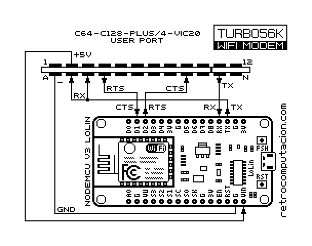
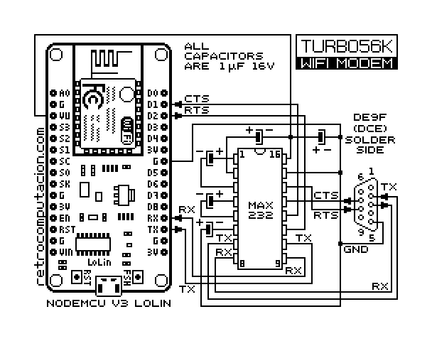
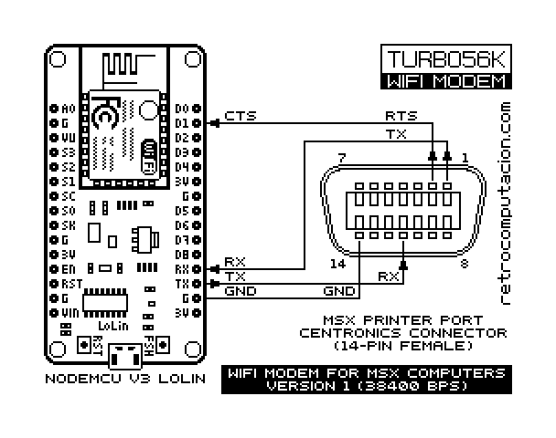
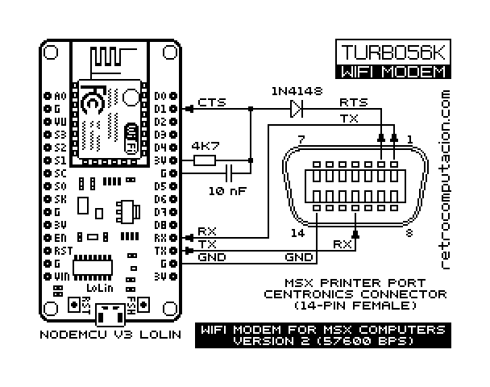
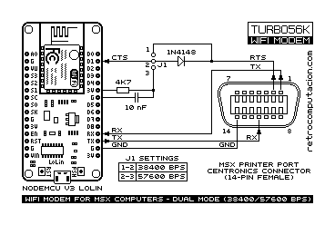

<div align = center>

# Retroterm
### VERSION 0.30

Jorge Castillo & Pablo Roldán


    [](https://discord.gg/F2jmuUCBAG)

---

</div>

## Table of contents:

1. [Introduction](#1-introduction)
   1. [Release history](#11-release-history)
   2. [The *Turbo56K* protocol](#12-the-turbo56k-protocol)
   3. [Features](#13-features)
   4. [Requirements](#14-requirements)  
2. [Usage](#2-usage)
3. [Building](#3-building-retroterm)
   1. [Symbols](#31-symbols)
   2. [Intro screen](#32-the-intro-screen)
   3. [Customizing](#33-customizing)
4. [Known bugs](#4-known-bugs)
5. [To-do](#5-to-do)
6. [Wi-fi modem schematics]
   1. [Commodore](#61-commodore)
   2. [RS-232](#62-rs-232)
   3. [MSX printer port](#63-msx-printer-port)
7. [Wi-fi Modem setup](#7-wi-fi-modem-setup)
8. [Acknowledgments](#8-acknowledgments)

---

## 1 Introduction

*Retroterm* is a small terminal with multimedia functions for the *Commodore 64 / 128 (in 64 mode)*, *Commodore Plus/4* and *MSX1*.

It implements the *[Turbo56k](docs/turbo56k.md)* protocol for high speed data transfer & streaming when connecting to a BBS supporting the protocol, such as [_RetroBBS_](https://github.com/retrocomputacion/retrobbs).

Data rate is fixed at the following speeds:

- 57600bps for Retroterm 64 for userport and Turbo232**
- 57600bps for Retroterm MSX for parallel port (very alpha state - candidate for deprecation)
- 38400bps for Retroterm 64 for Swiftlink**
- 38400bps for Retroterm MSX for parallel port (alpha state - mostly stable)
- 19200bps for Retroterm Plus/4**
- 19200bps for Retroterm MSX for RS232
- 57600bps for Retroterm BadCat (Zimodem firmware)

*(**)The full data throughput while using the turbo transfer / streaming can only be achieved with the screen disabled.*

> [!IMPORTANT]
> If experiencing PCM audio stutter with U1541-II, Ultimate 64, or Commodore 64U internal Swiftlink emulation, you need to the value of `Modem Settings->Tweaks->Loop Delay` to `10ms`

The effective throughput for text is *1500 / 1800bps* depending on *PAL/NTSC* timings respectively.

*Retroterm* is optimized for use with **Wi-Fi** modems using the *Zimodem* firmware.

*It also runs on the latest **VICE**/**Z64K** and **openMSX** emulators.*

Separate *Commodore 64* versions of the executable are provided for cartridges featuring an ACIA 6551 such as *SwiftLink* (limited to **38400bps**) and *Turbo232*.</br>
The *Commodore Plus/4* version is limited to the maximum speed for the built in ACIA: **19200bps**<br>
The *MSX 1 RS-232* version (rt-232.com) is also limited to **19200bps**, and only supports RS-232 interfaces that adhere to the MSX standard (ie: SVI-738 and HX-22 built-in ports, SVI-737 and Sony HB-232, or any other interface implemented with the i8251 + i8253 USART and Timer combo)<br>
The *MSX 1 BadCat* version (rt-bd.com) works with the BadCat cartridge or any other RS-232 interface that uses the i16550 UART.<br>
The *MSX 1 printer port* versions use a simple printer port Wi-fi modem interface. The 56K version has reduced capabilities.

## 1.1 Release history

### v0.30 (??/??/2026):
- Turbo56K v0.8
- Drawing primitives: clear screen, plot, line, box, ellipse, fill
- Ability to save a configuration file to disk.
Optional modem init string with selectable 300,1200 or 2400 baud speed.
- Phone book with up to 5 preset dial strings, also saved to the configuration file.
- Bugfix, all ports: No more missing filename characters when downloading to disk
- Bugfix, C64 ports: Fixed glitched sprites after downloading to disk

### v0.21 (Intermediate Github version, no oficial release):
- New shortcut key for the Plus/4 port: `CBM`+`,` disables/enables the FLASH-ON control code. Improves compatibility with BBSs running Centipede 128 software.
- Bugfix for the Commodore 64 ports: No more extraneous beep after streaming PCM audio.

### v0.20 (02/January/2024):
- Turbo56K v0.7
- New _Commodore Plus/4_ port. _Turbo56K v0.7_ commands implemented, except for the ones regarding SID tune streaming.
- Fixed bug in command $A3 which caused the parameter to be misread, or the terminal to hang
- New command `$86` to initiate a download to disk.
- New command `$B6` to scroll the text window up or down X number of rows.
- SID streaming now better supports tunes using _hardrestart_, a special version of _SIDdump_ and updated version of _RetroBBS_ is required.
- New compile target `ultimate` compiles with timings compatible with the Swiftlink emulation in the Ultimate1541-II/II+ and Ultimate64.
- Basic configuration screen by pressing `CBM`+`F7`, terminal screen is not preserved.
- ACIA based versions now allow selection of the interface base address ($DE00 or $DF00).
- Connected disk drives are scanned on first run, and can be selected when downloading a file with command `$86`.

### v0.14 (13/April/2022):
- Source code liberated
- Turbo56K v0.6
- Fixed small visual glitch when using the split screen mode
- Better, more robust exit to BASIC
- Disabled interrupts on command `$A2`, prevents crashes if (re)connecting to a BBS while the split screen mode is active
- Fixed severe bug affecting the text output in early Commodore 64 Kernal revisions
- Full digi-boost for 8580 SID
- Intro screen exits automatically after ~2 seconds by default
- Other small bugfixes.
### v0.13 (16/August/2021):
- Initial release
- Turbo56K v0.5


## 1.2 The Turbo56K protocol
*[Turbo56k](docs/turbo56k.md)* was created by Jorge Castillo as a simple protocol to provide high-speed file transfer functionality to his bit-banging 57600bps RS232 routine for the C64.
Over time, the protocol has been extended to include 4-bit PCM audio streaming, bitmap graphics transfer and display, SID music streaming and more.

## 1.3 Features

*Implements all commands of the __[Turbo56k](docs/turbo56k.md)__ v0.8 protocol.*

- Full duplex PETSCII (Commodore versions)/ASCII (MSX versions) color terminal
- Turbo data transfers to custom/preset memory locations
- Split Screen | Hi-res or Multicolor+Text
- Up to 11520Hz 4-bit PCM audio streaming
- Bitmap display | Hi-res + Multicolor (Commodore) | Screen 2 (MSX)
- Uses 16K of RAM above $C000 (For the Commodore 64 versions), the rest of the RAM is free to use as a buffer, load programs, graphics, etc.
- 1x speed SID music streaming (C64 versions)
- PSG music streaming (MSX versions, except `rt-56k.com`)
- Scrolling Text Windows
- Set Cursor Position
- Text Line Fill
- Bidirectional scrolling
- Download files to disk
- Graphic primitives, draw onto Hi-res/Multicolor screens
- Phone book with 5 entries

## 1.4 Requirements

- A Commodore 64 (or Commodore 64U), 128 or Plus/4 computer, or an emulator such as VICE or Z64K.
- Either an userport Wi-Fi modem with the Zimodem firmware or...
- A *SwiftLink* or *Turbo232* compatible cartridge connected to a Wi-Fi modem with the Zimodem firmware.
- An MSX1 or superior computer with 64K of RAM. With either a built-in RS-232 port or an MSX standard RS-232 interface cartridge. Or openMSX 20.0RC1
- An MSX1 or superior computer with a printer port Wi-fi modem.
- An MSX1 or superior computer with the BadCat cartridge with the Zimodem firmware.
- ACME and PASMO crossassemblers for building the programs.

## 2 Usage
*Retroterm* is very simple to use, most of its functionality being controlled externally from a *[Turbo56k](docs/turbo56k.md)* enabled BBS.

*Retroterm* comes in nine variants:

- **rt-cbm-u.prg** Userport version 57600bps
- **rt-cbm-sl.prg** SwiftLink version 38400bps
- **rt-cbm-ulti.prg** SwifLink Ultimate version 38400bps
- **rt-cbm-232.prg** Turbo232 version 57600bps
- **rt-cbm-p4.prg** Plus/4 version 19200bps
- **rt-232.com** MSX RS-232 version 19200bps
- **rt-38k.com** MSX parallel port version 38400bps
- **rt-56k.com** MSX parallel port version 57600bps
- **rt-bd.com** MSX BadCat version 57600bps


*Retroterm* lacks classic file transfer functions, when used to communicate with a normal PETSCII/ASCII BBS, file transfers are not available.

After running *Retroterm*, it will search for a configuration file on the last used drive, if found, and a modem initialization string is set, it will be sent at this moment. If no configuration file is found then the setup screen will be shown

The modem should be setup to the correct baud rate before leaving the initial setup screen. If the modem is not set at the correct speed, use the initialization string do so. You can then press F5 to save the settings to disk, and F1 to go to the terminal.

> [!NOTE]
> The initialization string is only sent before Retroterm goes to terminal mode for the first time. 

To exit *Retroterm*, just press `RUN/STOP` (Commodore) or `CTRL`+`C` (MSX), it will remain in memory, and you can recall it with `SYS49152` (Commodore 64), or `SYS28672` (Commodore Plus/4).

If you downloaded a program into memory from a BBS you can also `RUN` it (Commodore versions only).

On MSX pressing `CTRL`+`U` will reset the computer, if a ROM file was downloaded to RAM the system will try to execute it. ROMs that expect mirroring are not supported.

*Retroterm* beeps for every received character by default, you can toggle the sound by pressing `CBM`+`M` (Commodore) or `CTRL-W` (MSX).

## 2.1 Setup screen

A simple setup screen can be accessed by pressing `CBM`+`F7` (Commodore) or `CTRL`+`F5` (MSX), pressing `F1` will exit back to the terminal.

The first setting, common to all _Retroterm_ variants sets the **RTS** pulse width. Current values are known to work under VICE, or on real hardware with an userport modem using Zimodem firmware, and with the Ultimate Swiftlink emulation.
Use the `+` and `-` keys to adjust.

For the ACIA versions there's a couple more settings.

The first one sets the base address for the Swiftlink or Turbo232 cartridge, press `1` for $D700 or `2` for $DE00 or `3` for $DF00. Switching addresses will drop any current connection.

The second setting available for ACIA versions is the ability to keep the screen visible while transferring at turbo speeds. Turbo transfers are slightly slower with the screen enabled. Press `B` to toggle.

For C64 and Plus/4 ports, an optional modem initialization string can be edited by pressing `I`. The baud rate used to transmit this string can be set by pressing `R`, with current options being `SKIP`, `300`, `1200` and `2400`.
This string is only transmitted when running _Retroterm_ with `RUN`, automatically if a configuration file is found, or, if no file is found by selecting the appropriate options in the setup screen before exiting to the terminal.
Use `F5` to save the current settings to disk.

Finally, pressing `P` switches to the phone book screen, here you can select one of 5 preset dial strings and either `E`dit or `D`ial it.

>[!NOTE]
>Dialing only works once _Retroterm_ has been initialized properly, meaning only when accessing the setup screen from within the terminal mode


>[!IMPORTANT]
>Upon exiting the setup screen, _Retroterm_ will default to full screen text mode. Only previous background and border colors will be restored.

## 3 Building Retroterm
The Commodore versions of *Retroterm* are written for the *ACME* cross-assembler, while *PASMO* is used for the MSX port.

Exomizer is used to pack all the Commodore ports. Find these packed versions inside the `/build/packed/` subdirectory

To compile use:

```
make all
```
to compile all versions.

For all Commodore versions use
```
make cbm
```

For all MSX versions use
```
make msx
```

Or you can specify which version you want to compile, either `userport`, `swiflink`, `turbo232`, `plus4`, `msx232`, `msxbadcat`, `msx56k` or `msx38k`.

ie:
```
make userport
```
All executables will be stored in the `build` directory.

You can also manually compile with:
```
acme retroterm_univ.asm
```

or:
```
pasmo -E IFACE=0 retrotermm1.asm rt-msx-232.com
pasmo -E IFACE=56 retrotermmm1.asm rt-msx-56k.com
```

from the `source` directory.</br>
This will compile the default userport version of *Retroterm* with an intro screen that last a couple of seconds. In this case the resulting executable will be written to the `source` directory

## 3.1 Symbols
A number of compile time symbols are defined to customize the resulting executable. Specially if you're running the compiler directly instead of using the Makefile

### `_HARDTYPE_`:
`38`: Compile for *SwiftLink/Turbo232* cartridges at **38400bps**

`56`: Compile for userport at **57600bps** -- **_Default_**

`232`: Compile for *Turbo232* cartridges at **57600bps**

`1541`: Compile for the *Ultimate 1541-II* or *Ultimate 64/ Commodore 64U* Swiftlink emulation, same code as for `38` but different timing.

### `_INTRO_`:
`0`: No intro screen

`1`: Include the intro screen -- **_Default_**

### `_SPACE_`:
If defined wait for the user to press the space bar at the intro screen. Otherwise, the intro screen only last a couple of seconds.

**_Not defined by default_**

### `IFACE`:
`0`: Compile for standard MSX RS232 ports
`1`: Compile for the BadCat cartridge
`38`: Compile for the MSX parallel port (38400bps)
`56`: Compile for the MSX parallel port (57600bps)

### Example:

```
acme -D_HARDTYPE_=232 -D_INTRO_=0 retroterm_univ.asm
```
Compiles _Retroterm_ for the _Turbo232_ cartridge with no intro screen.

## 3.2 The intro screen
The intro screen is a _screencode plus colorRAM_ dump found in `source/intro_sc.asm`

This file is generated by exporting `source/intro_sc.petmate` to ACME format from [Petmate](https://nurpax.github.io/petmate/).

## 3.3 Customizing

If you want to release a modified version of _Retroterm_ which differs in functionality from the official release we recommend you use a custom _ID string_, respecting the maximum 22 character length and always starting in uppercase `RT`

IE, the normal ID string is:
```
IDstring:
!text "RTRETROTERM 0.20      "
```
but the string when compiling for the *SwiftLink* cartridge is:

```
IDstring:
!text "RTRETROTERM-SL 0.20   "
```

**Note: The actual version number string is sourced from the file `source/version.txt` when using the *makefile*, or from `source/version.asm` and `source/version-msx.asm` when running the compilers directly**


For compatibility reasons we ask you not to modify the behavior of existing Turbo56K commands, but you're welcomed to add new commands, or remove unwanted ones, as long as command `$A3` correctly reports the existence or not of all queried commands.

In any case the *[Turbo56k](docs/turbo56k.md)* version bytes that follow the ID string should remain the correct ones for the official version your modified code support.


## 4 Known bugs/Issues

- All versions: Losing connection while streaming data or audio will hang the program
- Commodore Plus/4 version: Exiting `Retroterm`, restarting it with `SYS28672`, exiting again and causing a BASIC error will crash the computer.
- Commodore Plus/4 version: `Retroterm` will crash if loaded from the file browser included in _Joco's C264 SD drive cartridge_. Loading from BASIC using the @ commands works fine.

## 5 To-do
- Faster throughput when using any of the ACIA cartridges.
- Adapting the MSX chiptune streaming buffering routine to the Commodore 64 versions.

## 6 Wi-Fi modem schematics

## 6.1 Commodore
For the Commodore 64 or Plus/4 userport version of Retroterm, you can use any userport Wi-fi modem with the Zimodem firmware and with the RTS and CTS connected.

>[!NOTE]
>Wi-fi modems that have a UP9600 mode switch will work with Retroterm on the C-64, with the switch in the off position.</br>
>However, those modems might cause problems with the Plus/4

If you want to build your own, you will need:

- 2x12 pin 3.96mm pitch female edge connector
- ESP8266 module, such as a Lolin or NodeMCU v3

<div align = center>



</div>

## 6.2 RS-232

The following schematic is for use with the Swiftlink, Turbo232 or MSX RS-232 versions of Retroterm.
The RS-232 connector shown correspond to a standard DE-9 RS-232 port. The actual pinout of your device's RS-232 interface might differ. Please consult your device manuals before building. 

>[!MPORTANT]
>This schematic does not invert the RTS and CTS control signals, read how to setup the modem correctly for this in the next section below

>[!NOTE]
>This modem needs an external USB power supply. Do not use another computer USB to power the modem at the same time you have it connected to the MSX or Commodore.


Parts list:

- Female DE-9 connector
- ESP8266 module, such as a Lolin or NodeMCU v3
- 4x 1uF 16v electrolitic capacitors
- MAX232 IC

<div align = center>



</div>


## 6.3 MSX printer port

This printer port modem is cheapest option to use Retroterm with an MSX computer that lacks a built-in RS-232 port.

>[!NOTE]
>This modem needs an external USB power supply. Do not use another computer USB to power the modem at the same time you have it connected to the MSX.

For the simplest (and recommended) 38400bps version the part list is very short:

- 14-pin female centronics connector
- ESP8266 module, such as a Lolin or NodeMCU v3

<div align = center>



</div>

For the 57600bps version (does not support audio streaming) these extra parts are needed:

- 1N4148 diode
- 4700 ohms resistor
- 10nF capacitor

<div align = center>



</div>

Adding a 3 pin jumper or a SPDT switch you get a modem that can work in both modes

<div align = center>



</div>

The ESP module should be flashed with the [Zimodem](https://github.com/bozimmerman/Zimodem/tree/v371) firmware, any version works, but 3.7.1 is recommended.

A precompiled version of Zimodem 3.5.4 is available [here](https://www.pastbytes.com/wifimodem/zimodem.ino.generic_4m_turbo56k_r1.bin)

If you want to compile the firmware yourself please follow the instructions at Zimodem's repository. Remember to select the correct ESP8266 board in the Arduino IDE menu's.

Once you have the firmware flashed, you need to setup the modem via USB, follow the instructions on the next section below.

## 7 Wi-fi modem setup

To work with Retroterm the Wi-Fi modem needs to be setup at the correct baud rate and to use hardware flow control.

> [!NOTE]
> The BadCat cartridge comes already configured with the correct settings. No further configuration is needed to use Retroterm

> [!NOTE]
> For all Commodore versions and the MSX RS-232 version, the default initialization string will setup correctly any Wi-fi modem using the Zimodem firmware 

For Zimodem firmware:

- `ATB` is the command to change the baud rate, for example `ATB57600` will change the baud rate to 57600 immediately after sending it.
- `ATF0` is the command to change the flow control to hardware (RTS/CTS). After sending this command on a terminal which doesn't support flow control (or when configuring the modem via USB), the modem might seem to stop responding, in reality the modem is still listening to commands but will not respond until its CTS line is set to the correct state.
- Commands can be chained together: `ATF0B57600` will change the flow control and baud rate in a single command string. This is, with different speeds, the default initialization string used in the Commodore and MSX-232 versions.

- `ATS48=1` and `ATS50=1` invert the polarity of the CTS and RTS lines respectively. These two commands are needed for the MSX printer port modems and the RS-232 modems if following the included schematic.

- `AT&W` saves the current modem configuration. Only really need to use this command if you're setting up the __MSX printer port__ version of the modem. The best way to use it is: `ATF0B38400&W` Note how the save command is last.

## 8 Acknowledgments
### Beta Testers
  
- **Ezequiel Filgueiras**
- **Thierry Kurt**
- **Diego de Franceschi**
- **ChrisKewl**
- **Roberto Mandracchia**
- **x1pepe**
- **Leonardo Vallone**
- **ZOMGUgoff**

### Thanks To
  
- **Willy Manilly** for adding support to the *Z64K emulator*

- [**ElectronicsArchiver**](https://github.com/ElectronicsArchiver) for initial documentation rework

- [**idolpx**](https://github.com/idolpx) for improved Makefile

- **x1pepe** and [**Andres Ortiz**](https://sites.google.com/view/badcatelectronics/home) for providing us with a BadCat cartridge for development.